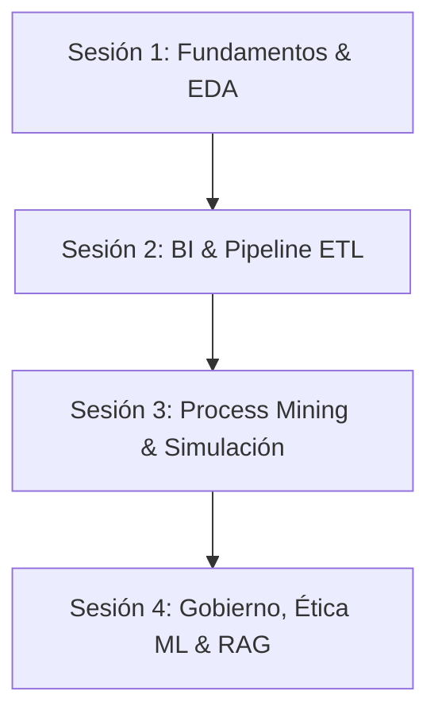

# Manual de Usuario — DistriAndina Analytics Lab 🎓

Bienvenido al **Manual de Usuario** oficial de **"DistriAndina Analytics Lab"**, la plataforma interactiva de simulación web diseñada para apoyar el aprendizaje práctico del diplomado en **Analítica Estratégica y Gobierno de Datos para las Organizaciones**.

Este manual está dirigido tanto al **docente** (para guiar la clase proyectada en aula) como a los **estudiantes** (para realizar experimentos, talleres y retos en sus propios computadores).

---

## 📖 Tabla de Contenidos

1. [Visión General & Caso de Estudio](#1-visión-general--caso-de-estudio)
2. [Instalación & Arranque Rápido](#2-instalación--arranque-rápido)
3. [Control Global de Datos (Barra Superior)](#3-control-global-de-datos-barra-superior)
4. [Guía de Navegación por Módulo](#4-guía-de-navegación-por-módulo)
   - [Móduo 1: Fundamentos y Analítica](#módulo-1-fundamentos-y-analítica)
   - [Módulo 2: BI y Decisiones](#módulo-2-bi-y-decisiones)
   - [Módulo 3: Automatización y RPA](#módulo-3-automatización-y-rpa)
   - [Módulo 4: Gobierno y Arquitectura](#módulo-4-gobierno-y-arquitectura)
   - [Secciones Transversales: Retos & Glosario](#secciones-transversales-retos--glosario)
5. [Guion de Clase Recomendado para el Docente](#5-guion-de-clase-recomendado-para-el-docente)
6. [Preguntas Frecuentes & Solución de Problemas](#6-preguntas-frecuentes--solución-de-problemas)

---

## 1. Visión General & Caso de Estudio

**DistriAndina S.A.S.** es una distribuidora mayorista colombiana de consumo masivo con operaciones en 4 ciudades principales (**Bogotá, Medellín, Cali y Barranquilla**) y un canal de venta **Online**.

La empresa comercializa 6 categorías de productos (Lácteos, Embutidos, Bebidas, Abarrotes, Enlatados y Limpieza) a más de 30 clientes corporativos y minoristas.

La aplicación simula en tiempo real todo el ecosistema de datos de la empresa (ventas diarias, log de eventos de pedidos, facturas de proveedores, series temporales de sensores IoT en bodega y solicitudes de crédito) y permite aplicar técnicas avanzadas de analítica, minería de procesos, ingeniería de datos y gobierno del dato.

### 🌟 Características Clave:
- **100% Local & Gratis:** No requiere llaves API ni servicios en la nube de pago.
- **Reproducible:** Usa semillas aleatorias (`seed=42`). Misma semilla → Mismos datos.
- **Modo Limpio vs. Sucio:** Inyección deliberada de errores para talleres de calidad y ETL.
- **Interactividad Total:** Gráficos dinámicos, simuladores de escenarios SimPy, modelo de equidad en Machine Learning y buscador semántico Mini-RAG local.

---

## 2. Instalación & Arranque Rápido

Tienes dos formas de ejecutar la plataforma:

### Opción A: Con Docker (1 Solo Comando — Recomendado) 🐳
Si tienes **Docker Desktop** instalado en tu computador:
1. Abre tu terminal en la carpeta del proyecto y corre:
   ```bash
   docker compose up -d
   ```
2. Abre tu navegador en **`http://localhost:8000`**.
   *¡Listo! Toda la aplicación (Frontend React y Backend FastAPI) se compila y ejecuta automáticamente en un solo contenedor.*
3. Para detener el simulador:
   ```bash
   docker compose down
   ```

---

### Opción B: Modo Desarrollo Tradicional (2 Terminales)

#### Requisitos Previos
- **Python 3.11, 3.12 o 3.13**
- **Node.js v18, v20 o v22** (con `npm`)

#### Paso 1: Iniciar el Backend (FastAPI)
Abre tu terminal en la carpeta raíz del proyecto (`SimuladorDiplomado`):
```powershell
cd backend
.\.venv\Scripts\python.exe -m uvicorn app.main:app --port 8000 --reload
```
> [!NOTE]
> El backend quedará ejecutándose en `http://127.0.0.1:8000`. Puedes verificar que está activo entrando a `http://127.0.0.1:8000/api/health`.

#### Paso 2: Iniciar el Frontend (React / Vite)
Abre una segunda terminal en la carpeta del proyecto:
```powershell
cd frontend
npm run dev
```
> [!TIP]
> Abre tu navegador en **`http://localhost:5173`**.

---

## 3. Control Global de Datos (Barra Superior)

En la parte superior fija de la pantalla encontrarás la **Barra de Control Global**:


### Elementos de la Barra Superior:
1. **Input de Semilla (`Semilla`):** Define el número entero que genera los datos. Por defecto es `42`. Al cambiar este número y pulsar "Regenerar Datos", se crea un universo sintético completamente nuevo pero reproducible.
2. **Selector de Modo (`Limpio` / `Sucio`):**
   - **`Limpio (Perfecto)`:** Genera datos sin errores para análisis descriptivos, diagnósticos y modelos predictivos optimizados.
   - **`Sucio (Con Errores)`:** Inyecta nulos, duplicados, atípicos, formatos rotos (`$ 15.000.000,00`) y fechas inválidas en las facturas y clientes para los laboratorios de ETL y calidad de datos.
3. **Boton `Regenerar Datos`:** Aplica los cambios de semilla o modo de forma instantánea actualizando todas las vistas y tableros.
4. **Badge de Estado Backend:** Muestra `100% Local (FastAPI)` en color verde cuando la comunicación con el servidor local es limpia.

---

## 4. Guía de Navegación por Módulo

---

### Módulo 1: Fundamentos y Analítica

#### A. Caso DistriAndina (`Caso DistriAndina`)
- **Propósito:** Introducir al estudiante al contexto de la empresa y la cadena de valor de Porter.
- **Uso:** Explora las 5 etapas de la cadena de valor (Logística de Entrada, Operaciones, Logística de Salida, Ventas y Servicio) y revisa la tabla comparativa con ejemplos prácticos de los 4 tipos de analítica (Descriptiva, Diagnóstica, Predictiva y Prescriptiva).

#### B. Generador de Datos (`Generador Datos`)
- **Propósito:** Explorar y descargar los 8 datasets sintéticos del caso.
- **Uso:** Haz clic en cualquiera de las 8 tarjetas (`catalogo`, `tiendas`, `clientes`, `ventas`, `pedidos_eventlog`, `sensores_bodega`, `facturas`, `credito_solicitudes`) para ver su número de filas y columnas, la vista previa de las primeras 12 filas y el botón para **Descargar CSV**.

#### C. Explorador EDA (`Explorador EDA`)
- **Propósito:** Realizar el Análisis Exploratorio de Datos (EDA).
- **Uso:**
  1. Selecciona la tabla a analizar en el desplegable.
  2. Revisa la tabla de estructura (tipos de datos, conteo de nulos, valores únicos, mín/media/máx).
  3. Haz clic en **Graficar** en cualquier columna numérica para generar el histograma de frecuencias y la caja de atípicos IQR.
  4. En la tabla de `ventas.csv`, examina el panel de **Análisis Diagnóstico (Drill-Down)** con ventas desglosadas por tienda, categoría y ciudad.

#### D. Quiz DIKW (`Quiz DIKW`)
- **Propósito:** Evaluar la comprensión de la jerarquía Dato → Información → Conocimiento → Acción.
- **Uso:** Responde las preguntas de opción múltiple paso a paso, identificando qué elemento del caso corresponde a cada nivel del modelo DIKW.

---

### Módulo 2: BI y Decisiones

#### A. Laboratorio ETL (`Laboratorio ETL`)
- **Propósito:** Practicar el proceso de Extracción, Transformación y Carga sobre facturas defectuosas.
- **Uso:**
  1. Asegúrate de tener activado el **Modo Sucio** desde la barra superior o con el botón amarillo.
  2. Pulsa en **Ejecutar Pipeline ETL**.
  3. Observa las 5 etapas del flujo (`1. Extraer` → `2. Limpiar Nulos` → `3. Deduplicar` → `4. Estandarizar Formatos` → `5. Tipar & Cargar`).
  4. Revisa las tarjetas con el **Reporte de Calidad en 6 Dimensiones** (Exactitud, Completitud, Consistencia, Oportunidad, Unicidad y Validez).
  5. Exporta el archivo de facturas limpias resultantes en CSV.

#### B. KPIs & Cuadro de Mando Integral (`KPIs & CMI`)
- **Propósito:** Monitorear el desempeño estratégico de la empresa a través del Balanced Scorecard.
- **Uso:** Analiza las 4 perspectivas estratégicas:
  - **Perspectiva Financiera:** Ventas totales, Margen bruto promedio, Ticket promedio.
  - **Perspectiva del Cliente:** Clientes corporativos activos, Participación del canal Online.
  - **Perspectiva de Procesos Internos:** Lead Time promedio de pedidos, Tasa de reprocesos.
  - **Perspectiva de Aprendizaje:** Productividad logística en bodega (cajas/hora).
  *Cada indicador cuenta con su meta estratégica y un semáforo (Verde / Amarillo / Rojo).*

---

### Módulo 3: Automatización y RPA

#### A. Process Mining Lab (`Process Mining`)
- **Propósito:** Descubrir procesos reales y detectar ineficiencias mediante el log de eventos de pedidos corporativos.
- **Uso:**
  1. Observa el banner superior que identifica automáticamente el **Cuello de Botella Principal** (`validar_credito` con ~38.5h de espera).
  2. Examina el **Grafo Descubierto del Proceso** (`GraphView`) que muestra la secuencia de actividades con tiempos medios de transición.
  3. Revisa la tabla de métricas por actividad y el indicador de **Tasa de Reprocesos** (casos con reintentos).
  4. Examina el listado de las 5 variantes (caminos) detectadas en el sistema.

#### B. Simulación SimPy (`Simulación SimPy`)
- **Propósito:** Evaluar cuantitativamente escenarios de capacidad y automatización previa a la inversión.
- **Uso:**
  1. Usa la barra deslizante para ajustar el **Número de Validadores de Crédito** (de 1 a 5).
  2. Activa o desactiva el botón de **Automatizar Facturación (RPA Bot)**.
  3. Pulsa **Ejecutar Simulación SimPy** y analiza el Lead Time resultante, la espera en crédito, la cola máxima y la utilización de recursos.
  4. Consulta el panel explicativo de la **Ley de Little ($L = \lambda W$)** para entender el trabajo en proceso (WIP).
  5. Revisa el gráfico de barras comparativo de escenarios predefinidos.

#### C. Hiperautomatización (`Hiperautomatización`)
- **Propósito:** Entender el marco conceptual RPA / BPM / IA.
- **Uso:** Explora las 3 tarjetas conceptuales ("RPA hace / BPM coordina / IA piensa") y visualiza el diagrama de flujo BPMN renderizado para el subproceso de radicación de facturas.

---

### Módulo 4: Gobierno y Arquitectura

#### A. Gobierno & Calidad (`Gobierno & Calidad`)
- **Propósito:** Consultar el catálogo de datos y ejecutar validaciones de calidad automáticas.
- **Uso:**
  1. Observa el **Score Global de Calidad de Datos** en tiempo real.
  2. Alterna entre el **Modo Limpio** (pasa el 100% de las reglas) y el **Modo Sucio** (las reglas fallan, mostrando alertas rojas).
  3. Consulta la tabla del **Catálogo de Datos & Data Governance** con los Data Owners asignados a cada tabla y la clasificación de sensibilidad.

#### B. Ética & Sesgo IA (`Ética & Sesgo IA`)
- **Propósito:** Identificar y mitigar la discriminación algorítmica en modelos de Machine Learning.
- **Uso:**
  1. Observa el banner de alerta y la métrica de **Disparate Impact (DI)** del modelo de scoring de crédito (`LogisticRegression`). Si $DI < 0.80$, se viola la regla del 4/5ths mostrando un sesgo discriminatorio contra mujeres.
  2. Pulsa en **Aplicar Mitigación de Sesgo** para ejecutar el rebalanceo por ajuste de umbral diferido.
  3. Compara el cuadro de resultados **Antes vs. Después de la Mitigación** para evaluar el *trade-off* entre exactitud global y equidad.

#### C. Medallion & RAG (`Medallion & RAG`)
- **Propósito:** Comprender la arquitectura Lakehouse en 3 capas y consultar normatividades mediante un buscador semántico.
- **Uso:**
  1. Analiza el mapa conceptual de las capas **Bronce (Raw)**, **Silver (Cleaned)** y **Gold (Aggregated)**.
  2. Escribe una pregunta en lenguaje natural en el buscador Mini-RAG (ej. *"¿Cuáles son las reglas para otorgar un crédito?"* o *"¿Cuál es la temperatura máxima de bodega?"*).
  3. Revisa los fragmentos devueltos con su puntuación de **Similitud Coseno** y la fuente original.

#### D. Plan Estratégico (`Plan Estratégico`)
- **Propósito:** Diseñar y exportar el Plan Estratégico de Datos de 1 página.
- **Uso:** Consulta los 4 pilares estratégicos de DistriAndina y exporta la plantilla en formato JSON.

---

### Secciones Transversales: Retos & Glosario

#### Retos Interactivos (`Retos (8 Ejercicios)`)
- **Propósito:** Evaluar los conocimientos adquiridos a lo largo de los 4 módulos.
- **Uso:** Responde los 8 ejercicios prácticos. Al seleccionar una opción obtendrás inmediatamente la retroalimentación visual (Correcto/Incorrecto) y la explicación teórica detallada.

#### Glosario Términos (`Glosario`)
- **Propósito:** Consultar la definición estándar y el ejemplo práctico del caso DistriAndina para cada término técnico del diplomado (DIKW, ETL, CMI, Process Mining, Ley de Little, Disparate Impact, Medallion, RAG, etc.).

---

## 5. Guion de Clase Recomendado para el Docente

Si vas a utilizar **DistriAndina Analytics Lab** en el aula de clases, te sugerimos la siguiente estructura de 4 sesiones:



### Sesión 1: Fundamentos & EDA (Módulo 1)
1. **Presentación (15 min):** Proyectar la pestaña **Caso DistriAndina** y explicar los eslabones de Porter.
2. **Demostración (20 min):** Usar el **Generador de Datos** para mostrar la reproducibilidad por semilla (`seed=42`).
3. **Taller Estudiantil (45 min):** Pedir a los estudiantes abrir el **Explorador EDA**, identificar la variable con mayor variabilidad en `sensores_bodega.csv` y realizar el drill-down de ventas por ciudad.
4. **Cierre (10 min):** Resolver en grupo el **Quiz DIKW**.

### Sesión 2: BI, ETL y Decisiones (Módulo 2)
1. **Exposición (20 min):** Explicar las 6 dimensiones de calidad de datos y el flujo ETL.
2. **Práctica Guiada (40 min):** Pedir a los alumnos cambiar a **Modo Sucio**, ir a **Laboratorio ETL** y ejecutar el pipeline. Analizar por qué la completitud y consistencia mejoran en la capa Silver.
3. **Análisis de Caso (30 min):** Abrir **KPIs & CMI**, revisar los semáforos del Balanced Scorecard y debatir acciones correctivas para los indicadores en rojo.

### Sesión 3: Process Mining & Simulación (Módulo 3)
1. **Demostración (25 min):** Proyectar **Process Mining Lab**, mostrar el Grafo Descubierto e identificar el cuello de botella en `validar_credito`.
2. **Experimento SimPy (40 min):** En **Simulación SimPy**, pedir a los alumnos simular 1 validador vs. 3 validadores y registrar el impacto en el Lead Time y en el WIP según la **Ley de Little**.
3. **Debate (25 min):** Discutir el concepto de Hiperautomatización (RPA + BPM + IA) y revisar el flujo BPMN.

### Sesión 4: Gobierno, Ética en IA & Arquitectura (Módulo 4)
1. **Taller de Gobierno (30 min):** Inspeccionar en **Gobierno & Calidad** las reglas ejecutables en modo limpio y sucio, asignando responsabilidades a los Data Owners.
2. **Debate Ético en IA (40 min):** Entrar a **Ética & Sesgo IA**, calcular el Disparate Impact inicial ($DI < 0.80$) y debatir la discriminación de género en scoring de crédito. Aplicar la mitigación y discutir el *trade-off* exactitud vs. equidad.
3. **Demostración RAG (20 min):** Probar el **Mini-RAG Local** realizando consultas sobre normatividades de crédito y calidad.
4. **Evaluación Final (30 min):** Resolver individualmente los **8 Retos Interactivos**.

---

## 6. Preguntas Frecuentes & Solución de Problemas

### ❓ ¿Qué hago si me aparece el mensaje "Backend Offline"?
- **Causa:** El servidor de Python FastAPI no se ha iniciado o se cerró.
- **Solución:** Abre una terminal en `backend` y ejecuta:
  ```powershell
  .\.venv\Scripts\python.exe -m uvicorn app.main:app --port 8000 --reload
  ```

### ❓ ¿Por qué al cambiar de semilla todos los números de las tablas se modifican?
- **Explicación:** El simulador genera los datos de forma pseudoaleatoria a partir de la semilla. Esto es normal y deseable para que el docente pueda asignar una semilla diferente a cada grupo de estudiantes en un examen (ej. Grupo A: `seed=10`, Grupo B: `seed=20`).

### ❓ ¿Se requieren credenciales o internet para usar el Mini-RAG o el modelo de crédito?
- **Respuesta:** No. El Mini-RAG funciona 100% en local usando vectores **TF-IDF + Similitud Coseno** sobre documentos normativos almacenados en el backend, y el modelo de crédito se entrena en tiempo real con `scikit-learn` en tu máquina.

---

**DistriAndina Analytics Lab** — *Herramienta educativa open source para el Gobierno de Datos y Analítica Estratégica.*
